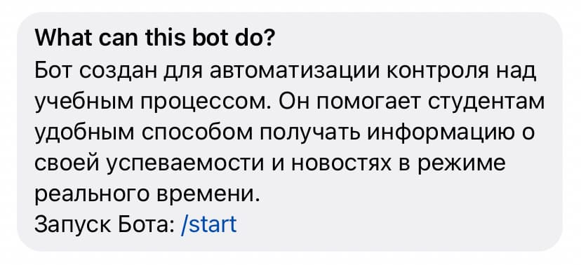
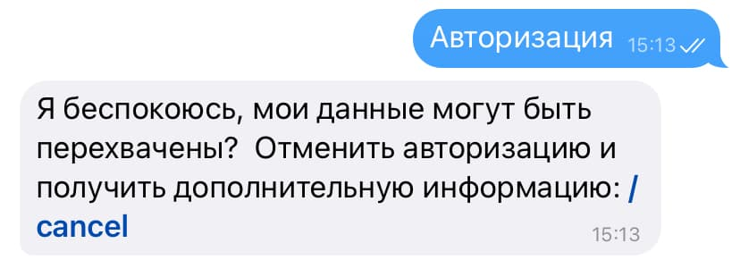

# Документация

* Бота можно найти по [ссылке](https://t.me/orioks_monitoring_bot) или по поиску @orioks_monitoring_bot.

* Перед Вами появится диалоговое окно. Нажмите кнопку `Начать`.

* Для получения доступа к Боту необходимо принять [Пользовательское соглашение](https://orioks-monitoring.github.io/bot/rules). Если Вы соглашаетесь с ним, нажмите на кнопку `Принять` под сообщением, в противном случае доступ к Боту не будет предоставлен.

* Поздавляем, Вы приняли [Пользовательское соглашение](https://orioks-monitoring.github.io/bot/rules)! Теперь Вы можете ознакомиться с инструкцией далее по команде `/manual` (кнопка `Руководство`) или выполнить вход в ОРИОКС по команде `/login` (кнопка `Авторизация`).

* В начале авторизации Вам будет предложено ввести логин ОРИОКС. Засомневались? Выполните команду `/cancel`, чтобы прервать авторизацию и ознакомиться с дополнительной информацией о нашем Боте и его безопасности. 

* При успешной авторизации Вы получите сообщение "Вход выполнен!". Внимание: у Вас только 10 попыток для входа! Превысив этот лимит, Вы потеряете доступ к боту.

* По команде `/notifysettings` (кнопка `Настройка уведомлений`) Вы можете вызвать меню выбора настроек уведомлений. Нажмите на кнопку нужной Вам категории, чтобы включить или выключить её. Эмодзи 🔔 и ❌ подскажут статус подписки.

* Хотите выйти из своего аккаунта ОРИОКС? Выполните команду `/logout`.

Список всех доступных команд бота с описанием представлен ниже. Так же он доступен в боте по кнопке `≡` в левом нижнем углу:

`/manual` - ознакомиться с инструкцией

`/login` - авторизация, вход в ОРИОКС

`/notifysettings` - настройка уведомлений

`/logout` - деавторизация, выход из ОРИОКС

[Назад](./)
