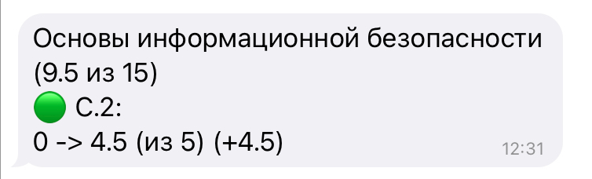
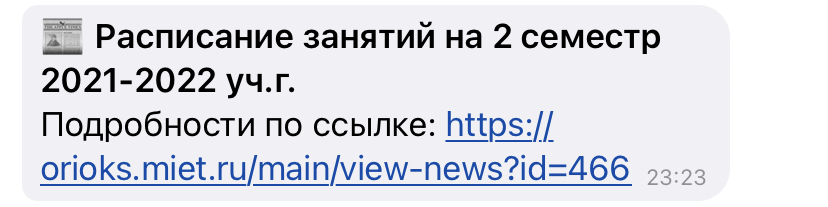
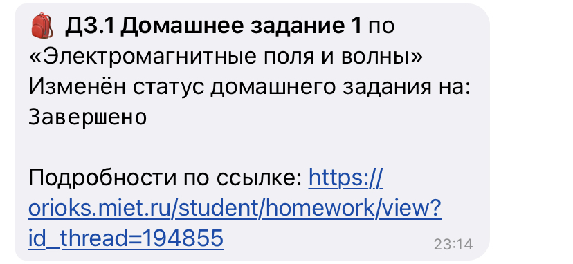
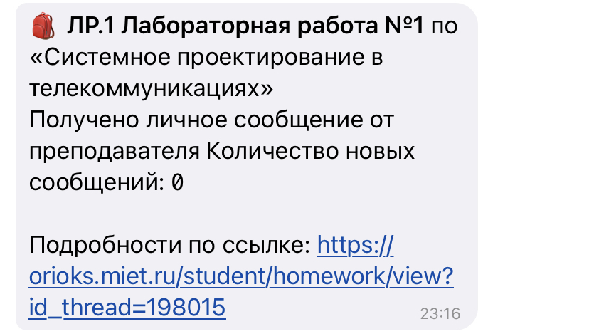

# FAQ

## Что это?
ORIOKS MONITORING - это бот для мониторинга образовательной электронной среды НИУ МИЭТ [orioks.miet.ru](https://orioks.miet.ru/) на платформе [Telegram](https://core.telegram.org/bots/api).

## Зачем это?
Бот создан для автоматизации контроля над учебным процессом. Он помогает студентам удобным способом получать информацию о своей успеваемости и новостях в режиме реального времени. 

## Как это работает?
Студент авторизируется в ОРИОКС через бота <!--- TODO: ссылка --->. Каждые <!--- TODO: n? ---> минут запускается скрипт, который сравнивает данные, хранящяется на сервере, с информацией от HTTP-клиента[^1] [AIOHTTP](https://docs.aiohttp.org/en/stable/). При появлении изменений студенту автоматически отправляется сообщение о них.

## Какие функции есть у этого бота?
На данный момент в боте реализованы следующие функции оповещений по категориям:
- раздел "Обучение": изменения баллов в накопительно-балльной системе (НБС)
  
- раздел "Новости": публикация преподавателями новостей по дисциплине;
  
- раздел "Ресурсы": изменения и загрузка файлов по дисциплине;
<!--- TODO: картинка --->
- раздел "Домашние задания": изменения статусов отправленных работ;
   
- раздел "Заявки": изменения статусов заявок на обходной лист, материальную помощь, социальную стипендию, копии документов, справки.
<!--- TODO: картинка --->

## Почему это безопасно?
Наш бот - проект с открытым исходным кодом. Он создан действующими студентами МИЭТ для помощи нашему университетскому сообществу. Вы можете просмотреть реализуемые скрипты и самостоятельно решить, пользоваться ли данным готовым ботом, или выбрать вариант для продвинутых пользователей (см. пункт ["Какие возможности есть ещe?"](#какие-возможности-есть-еще-для-продвинутых-пользователей) с реализацией на своем собственном сервере.

## Какие возможности есть еще? *(для продвинутых пользователей)*
Существуют два независимых скрипта, с помощью которых, имея опыт работы с [GitHub](https://github.com/) и API, можно реализовать работу скрипта на основе [GitHub Actions](https://docs.github.com/en/actions) с выбором платформы для оповещений ([API VK](https://dev.vk.com/) или [API Telegram](https://core.telegram.org/bots/api)) и хранением данных с помощью [API Yandex Disk](https://yandex.ru/dev/disk/rest/):
- [ORIOKS MONITORING SELENIUM](https://github.com/llirrikk/orioks-monitoring-selenium) - точный аналог настоящего репозитория
- [ORIOKS MONITORING API](https://github.com/llirrikk/orioks-monitoring-api) работает на основе [ORIOKS STUDENT API](https://orioks.gitlab.io/student-api/)[^2].

## У меня есть предложение / Я нашел баг. С кем можно связаться?
<!--- TODO: дописать про форму обратной связи --->

[^1]: HTTP-клиент - это библиотека методов выполнения [HTTP-запросов](https://habr.com/ru/post/215117/)

[^2]: [ORIOKS STUDENT API](https://orioks.gitlab.io/student-api/) имеет ряд весомых ограничений (не позволяет получить всю необходимую информацию (доступны оповещения только по разделу "Обучение") и имеет задежку в считывании выставленных баллов в НБС) по сравнению с [AIOHTTP](https://docs.aiohttp.org/en/stable/), поэтому его использование не рекомендуется.

[Назад](./)